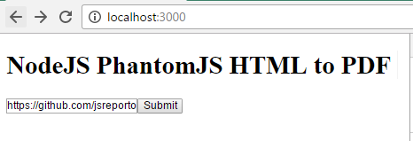

# NodeJS HTML to PDF Microservice

A Microservice to create PDF from HTM / URL.

## Usage as Local Service

Install dependencies with npm:

    npm Install

Starting the server:

    node html-pdf-server.js

The server will run on *http://localhost:3000/* per default. A webform for testing is included. Submit a URL and the browser will start to download the resulting PDF document:

To access the service directly, e.g. from a service or backend, send a POST request to *http://localhost:3000/process_url*

    curl 'http://localhost:3000/process_url' --data 'url=https://github.com/ggerhard/node-pdf-service' -o output.pdf

## Usage via Docker

Build a container:

    docker build -t node-pdf-service .

Start the container:

    docker run -p 3000:3000 -it --rm --name pdf-service node-pdf-service

## Credits and References

- Eric London - [NodeJS PhantomJS Screenshot](http://ericlondon.com/2014/04/04/nodejs-phantomjs-screenshot-via-express.html)
- @amir20 phantomjs-node examples: [https://github.com/amir20/phantomjs-node/tree/master/examples](https://github.com/amir20/phantomjs-node/tree/master/examples)
- PDF page configuration example: [http://we-love-php.blogspot.co.at/2012/12/create-pdf-invoices-with-html5-and-phantomjs.html](http://we-love-php.blogspot.co.at/2012/12/create-pdf-invoices-with-html5-and-phantomjs.html)
